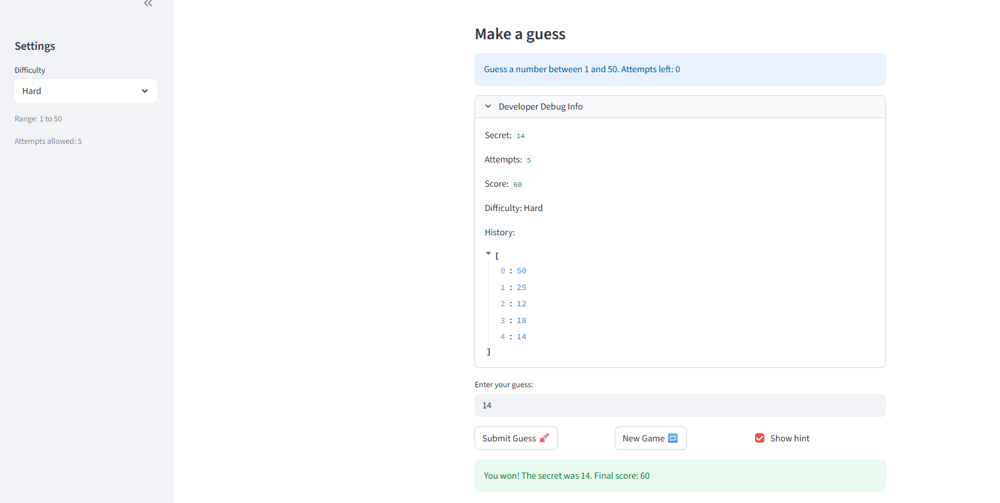
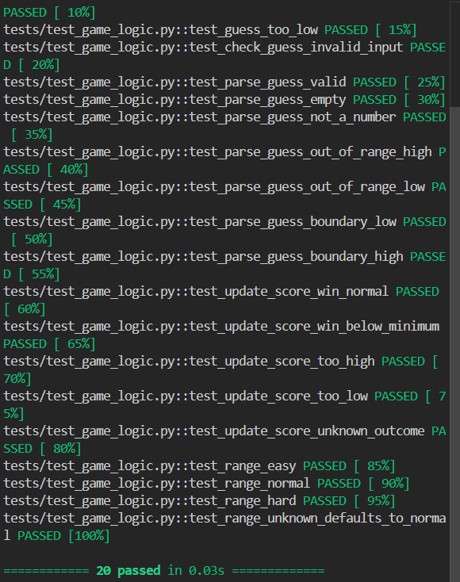

# 🎮 Game Glitch Investigator: The Impossible Guesser

## 🚨 The Situation

You asked an AI to build a simple "Number Guessing Game" using Streamlit.
It wrote the code, ran away, and now the game is unplayable. 

- You can't win.
- The hints lie to you.
- The secret number seems to have commitment issues.

## 🛠️ Setup

1. Install dependencies: `pip install -r requirements.txt`
2. Run the broken app: `python -m streamlit run app.py`

## 🕵️‍♂️ Your Mission

1. **Play the game.** Open the "Developer Debug Info" tab in the app to see the secret number. Try to win.
2. **Find the State Bug.** Why does the secret number change every time you click "Submit"? Ask ChatGPT: *"How do I keep a variable from resetting in Streamlit when I click a button?"*
3. **Fix the Logic.** The hints ("Higher/Lower") are wrong. Fix them.
4. **Refactor & Test.** - Move the logic into `logic_utils.py`.
   - Run `pytest` in your terminal.
   - Keep fixing until all tests pass!

## 📝 Document Your Experience

The purpose of the game is to have the user guess a secret RNG with hints telling the user to go higher or lower.

- Bugs found
   1. The feedback telling go high or low is giving misinformation
   2. low high message is not reflected when difficulty change
   3. secret is not updated on difficulty change resulted in secret out of low high range
   4. entering numbers out of range still consumed attempts
   5. attempts not working properly
   6. banners, developer info not updating in time  
   7. score and attempts not reseting on new game
   8. new game not working after game won
   9. (found late) scoring system is has

- edited the feedback logic.
- initialize game on difficulty change and new game
- add logic to check if verify input
- fixed attempt logic
- reorder function and banner calls

## 📸 Demo

-  

## 🚀 Stretch Features

challenge 1 

